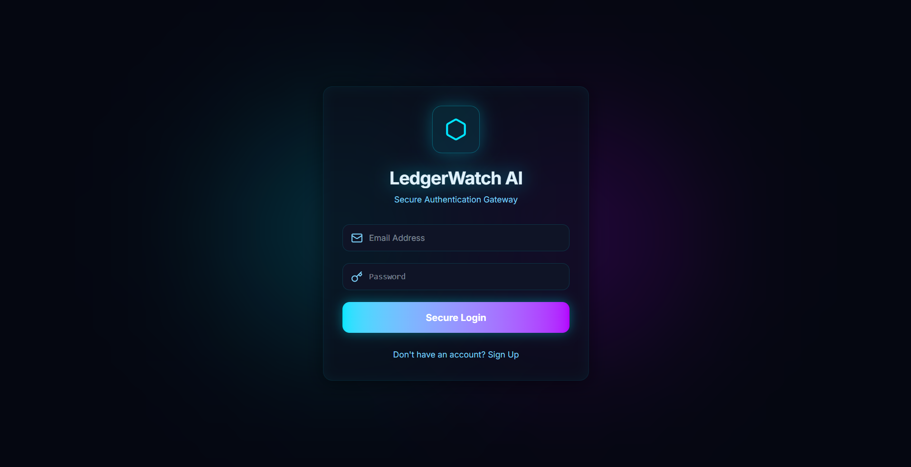
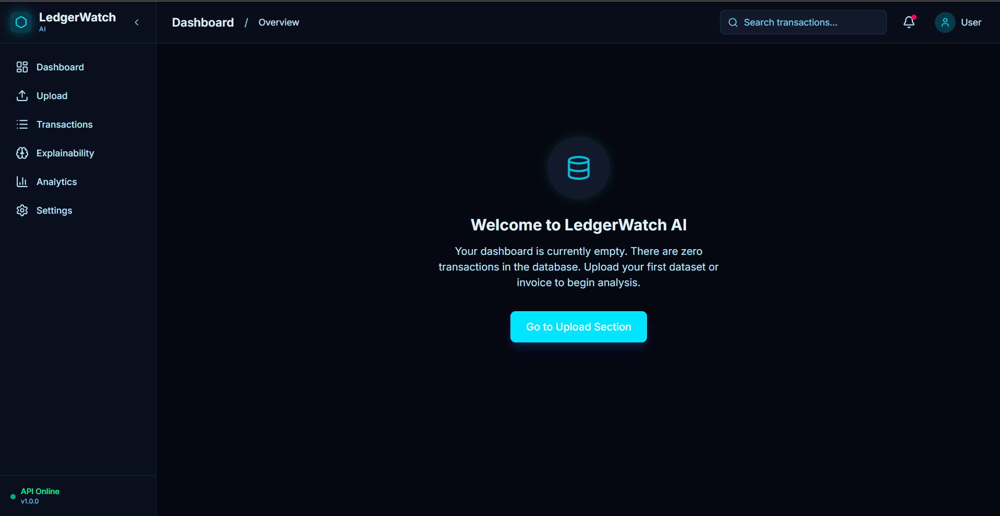
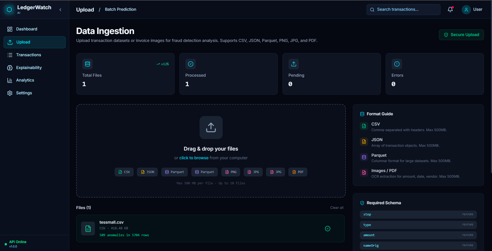
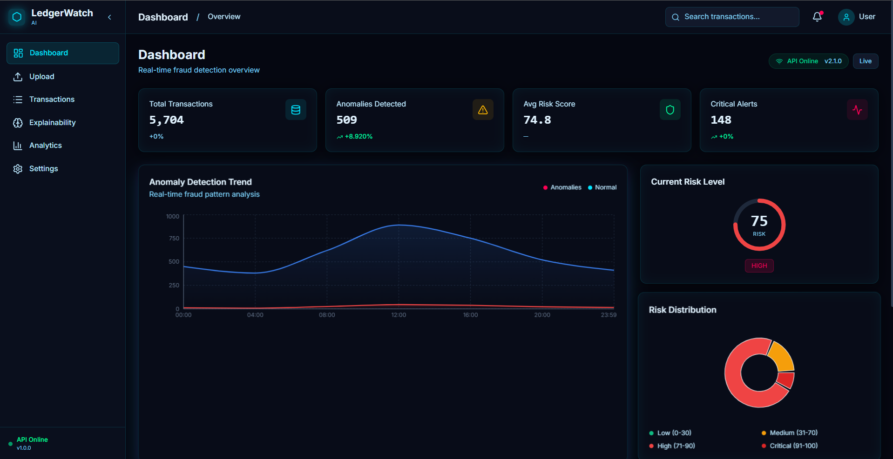
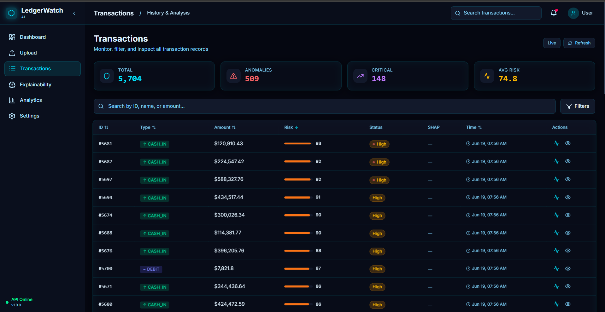
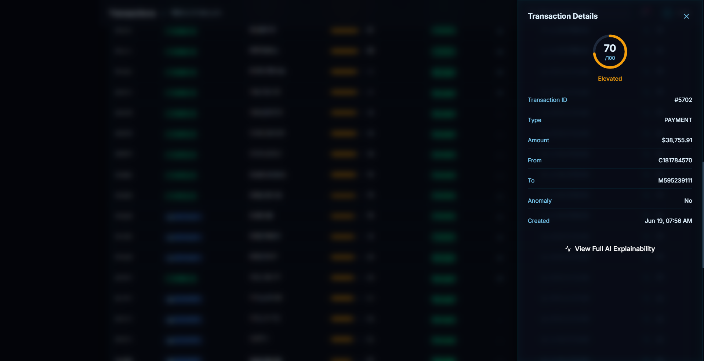
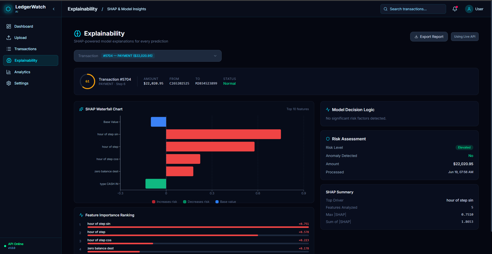
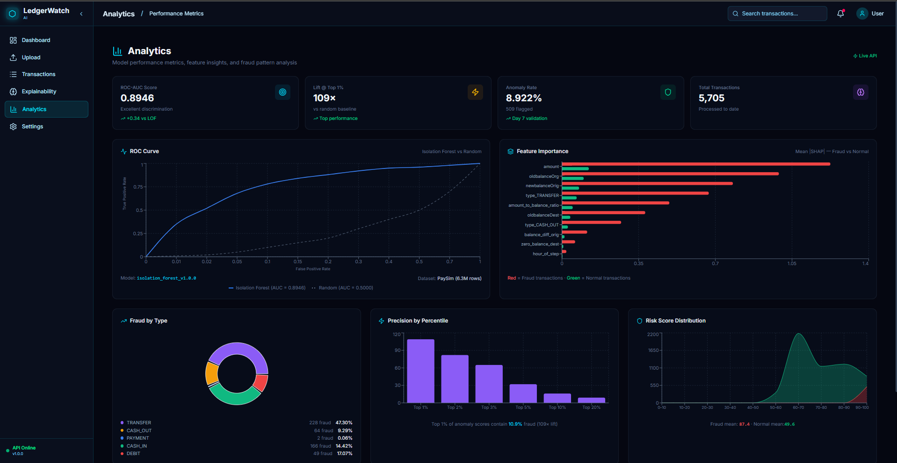

<div align="center">

# 🔍 LedgerWatch AI

**Enterprise-Grade Fraud Detection & Transaction Monitoring Platform**

[](https://python.org)
[](https://fastapi.tiangolo.com)
[](https://react.dev)
[](https://tailwindcss.com)
[](https://scikit-learn.org)
[](https://shap.readthedocs.io)
[](LICENSE)

[🚀 Live Demo](https://ledger-watch-ai.vercel.app/) · [📖 API Docs](https://ledgerwatch-ai.onrender.com/docs) · [📊 Documentation](docs/LedgerWatch_Complete_Documentation.md)

</div>

---

## 🎯 Executive Summary

**LedgerWatch AI** is a full-stack, machine learning-driven platform designed to detect fraudulent financial transactions and anomalous invoices without relying on pre-labeled data. 

In the real world, fraud labels are rare. LedgerWatch solves this by leveraging an **Unsupervised Isolation Forest** model trained on over 6.3 million transactions. It learns the multi-dimensional shape of "normal" behavior and calculates an anomaly score for new transactions. This mathematical score is then calibrated by a **Risk Engine** into an intuitive 0-100 percentile, and explained visually using **SHAP (SHapley Additive exPlanations)** to ensure AI transparency for compliance and analyst review.

Coupled with a robust **OCR Invoice Parsing** engine and a production-ready **React Dashboard**, LedgerWatch AI provides an end-to-end fraud monitoring solution.

---

## ✨ Key Features

| Feature | Description | Business Value |
|---------|-------------|----------------|
| **Unsupervised Learning** | Isolation Forest model trained on 6.3M rows. | Operates perfectly on unlabeled real-world financial data. |
| **SHAP Explainability** | Generates feature-importance waterfall charts. | Critical for regulatory compliance—every prediction has a "why". |
| **Risk Calibration** | Maps raw anomaly math to a 0-100 percentile score. | Analysts can easily filter, prioritize, and define alert thresholds. |
| **OCR Invoice Parsing** | Extracts structured entities (Vendor, Amount, Date) from PDFs via Tesseract. | Unifies unstructured invoice data with tabular transaction data. |
| **Real-time Dashboard** | React 18, Tailwind v4, Recharts, drag-and-drop batch processing. | Professional, dark-mode fintech UX for operational monitoring. |

---

## 📸 Frontend Pages & Walkthrough

Here is a visual walkthrough of the **LedgerWatch AI** platform, demonstrating the end-to-end user workflow:

### 1. Secure Access (Login Page)

*Modern, secure authentication screen guarding the financial ledger data.*

### 2. Control Dashboard (Before Upload)

*Initial clean state of the dashboard upon logging in, showing no active data.*

### 3. CSV & PDF Invoice Upload

*Drag-and-drop batch processing interface supporting CSV ledger uploads and PDF invoices parsed via Tesseract OCR.*

### 4. Control Dashboard (After Upload & ML Inferences)

*Real-time active state with overall risk indicators, processed transaction volumes, and key anomaly scores.*

### 5. Audit Ledger & Transaction Monitoring

*Interactive tabular view of all ingested transactions with real-time risk calibration badges, sorting, and advanced filters.*

### 6. Transaction Inspector

*Deep-dive inspector pane displaying full structured metadata and properties of a selected transaction.*

### 7. Explainable AI (SHAP Waterfall)

*Interactive local explainability page visualizing exactly which features pushed the transaction score towards normal or anomalous.*

### 8. Analytics & Risk Distributions

*Aggregated risk curves, data trends, and machine learning model metrics for audit reports.*

---

## 🏗️ System Architecture

```text
┌─────────────┐     ┌─────────────┐     ┌─────────────────────────────┐
│ Invoice PDF │────▶│ OCR Service │────▶│      FastAPI Backend        │
│  (Tesseract)│     │             │     │                             │
└─────────────┘     └─────────────┘     │  • /predict                 │
                                        │  • /batch-predict           │
┌─────────────┐     ┌─────────────┐     │  • /ocr                     │
│ CSV Upload  │────▶│ Data Ingest │────▶│  • /transactions            │
│  (Raw Data) │     │  Pipeline   │     │  • /stats                   │
└─────────────┘     └─────────────┘     └──────────────┬──────────────┘
                                                       │
       ┌───────────────────────────────────────────────┘
       ▼
┌─────────────────────────────────────────────────────────────────────┐
│                         SQLite Database                             │
└─────────────────────────────────────────────────────────────────────┘
       │
       ▼
┌──────────────┐    ┌──────────────┐    ┌──────────────┐
│   Feature    │───▶│   Isolation  │───▶│ Risk Engine  │
│ Engineering  │    │   Forest     │    │  (0-100)     │
│  (24 feats)  │    │ (6.3M rows)  │    │ Calibration  │
└──────────────┘    └──────────────┘    └──────┬───────┘
                                               │
       ┌───────────────────────────────────────┘
       ▼
┌──────────────┐    ┌─────────────────────────────────────────────────┐
│ SHAP Explain │───▶│           React Frontend Dashboard              │
│ (Waterfall)  │    │  Vite + Tailwind v4 + Recharts + React Router   │
└──────────────┘    └─────────────────────────────────────────────────┘
```

---

## 📂 Project Structure

```text
LedgerWatch-AI/
├── backend/                    # FastAPI application and ML pipeline
│   ├── main.py                 # Core API endpoints & server setup
│   ├── src/                    # Machine Learning & Business Logic
│   │   ├── train.py            # Isolation Forest training pipeline
│   │   ├── risk_engine.py      # Percentile-based 0-100 scoring
│   │   ├── explain.py          # SHAP TreeExplainer wrapper
│   │   ├── ocr_service.py      # Tesseract + regex invoice parser
│   │   └── features.py         # 24-feature engineering pipeline
│   ├── saved_models/           # Serialized .joblib models
│   └── tests/                  # Pytest test suite
├── frontend/                   # React frontend application
│   ├── src/
│   │   ├── pages/              # Main UI views (Dashboard, Upload, etc.)
│   │   ├── components/         # Reusable UI elements (Charts, Tables, Layouts)
│   │   └── index.css           # Tailwind v4 theme tokens
├── data/                       # Raw and processed datasets, test invoices
├── docs/                       # Project documentation and screenshots
├── notebooks/                  # EDA and model research notebooks
└── render.yaml                 # Render cloud deployment config
```

---

## 🏆 Model Performance & Metrics

Trained on the **PaySim Dataset** (6,362,620 transactions).

| Metric | Value | Interpretation |
|--------|-------|----------------|
| **ROC-AUC** | **0.8946** | Excellent discrimination capability. |
| **Lift @ Top 1%** | **109×** | The top 1% of highest-risk scores contain 109x more fraud than a random sample. |
| **Separation Ratio** | **1.76×** | Fraudulent transactions score, on average, 1.76x higher than normal ones. |
| **Inference Time** | **~50ms/1K** | Highly scalable for real-time streaming architectures. |

---

## 🛠️ Technology Stack

### Backend & Machine Learning
- **Python 3.11** / **FastAPI 0.109**: Async REST API framework.
- **scikit-learn 1.4**: Core Isolation Forest implementation.
- **SHAP 0.44**: TreeExplainer for feature importance visualization.
- **SQLAlchemy 2.0 / Pydantic v2**: ORM and request/response type validation.
- **Tesseract OCR 5.x**: Invoice text extraction.

### Frontend
- **React 18 / Vite 5**: UI framework and build tooling.
- **Tailwind CSS v4**: Utility-first styling with modern CSS-first configuration.
- **Recharts 2**: Interactive SVG charting for analytics.
- **Lucide React**: Modern iconography.

---

## 🚀 Quick Start Guide

### Prerequisites
- Python 3.11+
- Node.js 18+
- Tesseract OCR (Optional: API will fallback to Mock Mode if not installed)

### 1. Backend Setup
```bash
# Clone repository
git clone https://github.com/yourusername/LedgerWatch-AI.git
cd LedgerWatch-AI

# Create virtual environment
python -m venv venv
source venv/bin/activate  # Windows: venv\Scripts\activate

# Install dependencies
pip install -r backend/requirements.txt

# Configure environment
cp .env.example .env

# Run FastAPI Server
cd backend
uvicorn main:app --reload
```
API Documentation available at: `http://localhost:8000/docs`

### 2. Frontend Setup
```bash
# Open a new terminal
cd LedgerWatch-AI/frontend

# Install node modules
npm install

# Start React development server
npm run dev
```
Dashboard available at: `http://localhost:5173`

---

## 📡 API Reference

Authentication is handled via the `X-API-Key` header. 

| Endpoint | Method | Description |
|----------|--------|-------------|
| `/predict` | `POST` | Single transaction anomaly prediction with optional SHAP explanation. |
| `/batch-predict` | `POST` | Bulk CSV processing. Handles files up to 10MB. |
| `/ocr` | `POST` | Upload PDF/PNG invoices for structured Tesseract parsing. |
| `/transactions` | `GET` | Query and filter historical transactions stored in SQLite. |
| `/stats` | `GET` | Retrieve aggregated KPIs and global risk distributions for dashboards. |

---

## 📁 Comprehensive Documentation

For an in-depth breakdown of every file, architectural decisions, and the challenges faced during development (e.g. Model Serialization, SHAP mathematical sign-flipping, and feature space alignment), please refer to our official guide:

👉 **[Read the Complete Technical & Interview Guide](docs/LedgerWatch_Complete_Documentation.md)**

---

## 🌐 Deployment Overview

- **Backend / API**: Deployed via **Render** using the included `render.yaml`. Automated Tesseract installation is handled during the build phase.
- **Frontend / UI**: Hosted globally on the Edge via **Vercel**. 

---

<div align="center">

**Built by Kalpit** — Electronics Engineering Student

[MIT License](LICENSE) | [Back to Top](#-ledgerwatch-ai)

</div>
