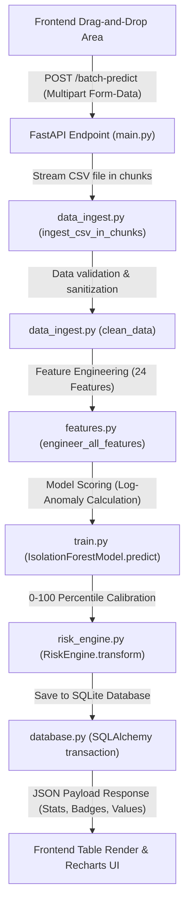
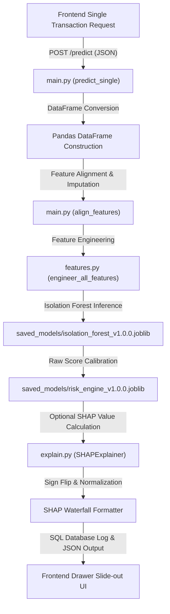

# 🔍 LedgerWatch AI: Comprehensive Thesis & Complete Reference Guide

This document serves as the **definitive, production-grade technical thesis and exhaustive reference manual** for the LedgerWatch AI project. It breaks down every single file, module, mathematical transformation, pipeline design, and component in detail. It is structured to help software developers, data scientists, and systems architects understand the codebase, and to prepare for engineering reviews.

---

## 1. Architectural Blueprint & Data Flow Pipelines

LedgerWatch AI is built on a split-plane architecture: a stateless **FastAPI backend** running an unsupervised machine learning inference pipeline backed by SQLite, and a reactive, dark-theme **React frontend** built on Vite and Tailwind CSS.

### 1.1 The Batch Ingestion & Inference Pipeline
When a user uploads a ledger CSV file via the frontend, the following sequential pipeline is executed:



### 1.2 The Single Transaction Real-Time Pipeline
When an analyst inspects or manually evaluates a single transaction, the stateless `/predict` endpoint is queried:



---

## 2. Backend Subsystem Deep-Dive

### 2.1 File-by-File Code & Functional Analysis

#### 2.1.1 [main.py](file:///f:/ML%20PROJECT/LedgerWatch-AI/LedgerWatch-AI/backend/main.py)
* **Purpose**: Serves as the central server controller, defining HTTP routing, CORS security middleware, schema conversion adapters, and task orchestration loops.
* **Core Functions & Endpoints**:
  * `get_risk_band(score: float) -> str`: Categorizes a calibrated 0-100 score:
    * `score >= 91`: `"Critical"`
    * `score >= 76`: `"High"`
    * `score >= 50`: `"Medium"`
    * `otherwise`: `"Low"`
  * `align_features(X: pd.DataFrame, expected_features: List[str]) -> pd.DataFrame`: Dynamically checks the incoming feature vector `X` against the list of features expected by the Isolation Forest. If any engineered columns are missing, it imputes them with `0.0`. This ensures that real-time predictions do not fail with shape mismatch errors (`ValueError: number of features mismatch`).
  * `POST /predict?explain=true`:
    * **Inputs**: JSON payload mapping to `TransactionCreate` schema.
    * **Outputs**: JSON containing calculated risk score, risk band, binary anomaly flag (`is_anomaly`), and optionally a dictionary of SHAP values.
  * `POST /batch-predict`:
    * **Inputs**: Multipart file upload (`file: UploadFile`).
    * **Logic**: Streams the file into memory using `StringIO`, checks minimum required headers, processes features in batches of `10,000` rows using chunking to maintain a low RAM footprint, runs model inference, updates database logs, and returns summary metrics.
  * `POST /ocr`:
    * **Inputs**: Uploaded image or PDF document.
    * **Logic**: Passes the file binary stream directly to the OCR subsystem to extract values.

#### 2.1.2 [src/features.py](file:///f:/ML%20PROJECT/LedgerWatch-AI/LedgerWatch-AI/backend/src/features.py)
* **Purpose**: Implements the feature engineering pipeline. It transforms raw transactional fields into 24 distinct numeric input columns.
* **Core Transform Functions**:
  * `_log_transform_amount(df: pd.DataFrame) -> pd.DataFrame`: Computes the natural log plus one:
    $$\text{amount\_log} = \ln(\text{amount} + 1)$$
    This stabilizes feature variance by reducing the scale of large transfer values, preventing skewness in the model.
  * `_encode_cyclical_time(df: pd.DataFrame) -> pd.DataFrame`: Normalizes hour values into sine and cosine pairs:
    $$\text{hour\_sin} = \sin\left(\frac{2\pi \cdot \text{hour}}{24}\right), \quad \text{hour\_cos} = \cos\left(\frac{2\pi \cdot \text{hour}}{24}\right)$$
    This preserves the cyclic nature of time, ensuring the model treats late-night and early-morning hours as adjacent.
  * `_balance_diffs(df: pd.DataFrame) -> pd.DataFrame`: Computes transaction imbalances for origin and destination accounts:
    $$\text{orig\_balance\_diff} = \text{oldbalanceOrg} - \text{newbalanceOrig} - \text{amount}$$
    $$\text{dest\_balance\_diff} = \text{newbalanceDest} - \text{oldbalanceDest} - \text{amount}$$
    Large non-zero differences here are strong indicators of manual database entry manipulations or fraud.
  * `_zero_balance_flags(df: pd.DataFrame) -> pd.DataFrame`: Binary flags checking if the origin account was completely emptied (`newbalanceOrig == 0`) or if the destination account received funds but remained at zero (`newbalanceDest == 0`), which are common patterns in transactional theft.

#### 2.1.3 [src/train.py](file:///f:/ML%20PROJECT/LedgerWatch-AI/LedgerWatch-AI/backend/src/train.py)
* **Purpose**: Orchestrates training and validation of the Isolation Forest model.
* **Core Functions**:
  * `IsolationForestModel.train(X_train: pd.DataFrame)`: Configures and fits the `sklearn.ensemble.IsolationForest` estimator.
  * `IsolationForestModel.predict(X: pd.DataFrame) -> np.ndarray`: Returns raw anomaly scores.
    * **Isolation Forest Scoring Math**:
      $$s(x, n) = 2^{-\frac{E(h(x))}{c(n)}}$$
      where $h(x)$ is the path length in a tree, $E(h(x))$ is the average path length across all trees, and $c(n)$ is the average path length of an unsuccessful search in a Binary Search Tree. Anomalies are isolated closer to the root, resulting in shorter path lengths and scores near $1.0$.
  * `save_model() / load_model()`: Serializes and deserializes the fitted model instance using `joblib`.

#### 2.1.4 [src/risk_engine.py](file:///f:/ML%20PROJECT/LedgerWatch-AI/LedgerWatch-AI/backend/src/risk_engine.py)
* **Purpose**: Calibrates the raw output scores from the Isolation Forest into an intuitive risk score.
* **Algorithm**:
  * Raw anomaly scores from scikit-learn's `score_samples()` are usually negative floats where smaller values represent higher anomaly risk.
  * The `RiskEngine` maps these raw scores to a 0-100 scale using empirical percentiles:
    * `fit(scores)`: Computes and stores percentile values from the training distribution.
    * `transform(score) -> float`: Evaluates where a new raw score falls relative to the training percentiles. A score of `95` means the transaction is more anomalous than 95% of the baseline training data.

#### 2.1.5 [src/explain.py](file:///f:/ML%20PROJECT/LedgerWatch-AI/LedgerWatch-AI/backend/src/explain.py)
* **Purpose**: Implements the Explainable AI (XAI) layer using SHAP (SHapley Additive exPlanations) to explain individual predictions.
* **The Directionality Fix**:
  * In scikit-learn, the Isolation Forest scoring is designed such that *smaller/more negative* scores represent anomalies. Consequently, standard SHAP attributions for anomalies are negative.
  * In the user dashboard, however, *higher* calibrated scores (0-100) represent anomalies.
  * To align the explanation direction, `explain.py` flips the sign of the raw SHAP values:
    $$\text{SHAP\_display} = -1.0 \times \text{SHAP\_raw}$$
    This ensures that positive SHAP values in the UI indicate features that increased the risk score, while negative values indicate features that kept it normal.
* **Core Functions**:
  * `explain_prediction(X_row: pd.DataFrame) -> dict`: Computes local SHAP values for the input row and returns a dictionary mapping feature names to their respective attributions.
  * `get_top_features(shap_dict: dict, top_n: int = 5) -> dict`: Sorts the attributions by absolute value and returns the top $N$ contributors.

#### 2.1.6 [src/ocr_service.py](file:///f:/ML%20PROJECT/LedgerWatch-AI/LedgerWatch-AI/backend/src/ocr_service.py)
* **Purpose**: Extracts text and key entity values from unstructured invoice images or PDFs.
* **Core Functions**:
  * `extract_text(file_bytes: bytes, filename: str) -> str`: Converts PDFs to temporary images using `PyMuPDF` (`fitz`), then extracts text using `pytesseract.image_to_string`.
  * Entity extraction uses regular expressions:
    * **Amount Extraction**: Searches for typical total patterns:
      `r'(?i)(?:total|grand\s*total|amount\s*due|net\s*total)\s*[:$]?\s*([\d,]+\.\d{2})'`
    * **Date Extraction**: Searches for standard date formats:
      `r'(\d{4}[-/]\d{2}[-/]\d{2}|\d{2}[-/]\d{2}[-/]\d{4})'`
  * **Fallback Handling**: If Tesseract is not installed on the system (e.g., in resource-constrained environments), it runs in mock mode, using file hashes or metadata to generate consistent mock extractions rather than failing.

#### 2.1.7 [src/database.py](file:///f:/ML%20PROJECT/LedgerWatch-AI/LedgerWatch-AI/backend/src/database.py)
* **Purpose**: Manages database connections and defines the SQLAlchemy ORM models.
* **Core Models**:
  * `Transaction`: Maps the ledger transactions to the database. Stores transactional details alongside calculation outputs like `risk_score`, `risk_band`, and `shap_explanation` (stored as a JSON string).
  * `User`: Stores authentication details, including username and hashed password.

#### 2.1.8 [src/auth.py](file:///f:/ML%20PROJECT/LedgerWatch-AI/LedgerWatch-AI/backend/src/auth.py)
* **Purpose**: Handles security, password hashing, and token validation.
* **Core Logic**:
  * Password hashing is implemented using `passlib.context.CryptContext` with `bcrypt`.
  * Session authorization uses JWT tokens generated via `python-jose` with HS256 sign algorithms.

#### 2.1.9 [src/config.py](file:///f:/ML%20PROJECT/LedgerWatch-AI/LedgerWatch-AI/backend/src/config.py)
* **Purpose**: Centralizes configuration, loading variables from environment settings with automatic type coercion via `pydantic_settings.BaseSettings`.
* **Validation**:
  * Includes a path validator that checks for the presence of the serialized model and risk engine files during system startup.

#### 2.1.10 [src/schemas.py](file:///f:/ML%20PROJECT/LedgerWatch-AI/LedgerWatch-AI/backend/src/schemas.py)
* **Purpose**: Defines request and response validation schemas using Pydantic.
* **Validation**:
  * Validates fields such as transaction types, negative transaction amounts, and empty string headers before requests hit the business logic.

---

## 3. Frontend Subsystem Deep-Dive

### 3.1 Page Components

#### 3.1.1 [Dashboard.jsx](file:///f:/ML%20PROJECT/LedgerWatch-AI/LedgerWatch-AI/frontend/src/pages/Dashboard.jsx)
* **Purpose**: Renders the executive analytics dashboard.
* **Logic**:
  * Uses the `useStats()` hook to fetch metrics from `/stats`.
  * Computes overall statistics such as the anomaly rate:
    $$\text{Anomaly Rate} = \frac{\text{Anomalies Detected}}{\text{Total Transactions}} \times 100\%$$
  * Renders interactive charts for daily volumes and anomaly distributions using `recharts`.

#### 3.1.2 [UploadPage.jsx](file:///f:/ML%20PROJECT/LedgerWatch-AI/LedgerWatch-AI/frontend/src/pages/UploadPage.jsx)
* **Purpose**: Handles file uploads.
* **Logic**:
  * Implements drag-and-drop zone event handlers.
  * Determines file types by extension and routes them to the appropriate endpoints: CSV uploads to `/batch-predict`, images/PDFs to `/ocr`.
  * Simulates upload progress bars using a local interval timer while waiting for backend execution.

#### 3.1.3 [TransactionsPage.jsx](file:///f:/ML%20PROJECT/LedgerWatch-AI/LedgerWatch-AI/frontend/src/pages/TransactionsPage.jsx)
* **Purpose**: Renders the paginated transaction ledger.
* **Logic**:
  * Manages filtering state (by search queries, risk levels, and offsets).
  * Clicking on a row opens the slide-out `DetailDrawer` containing detailed SHAP explainability charts.

#### 3.1.4 [ExplainabilityPage.jsx](file:///f:/ML%20PROJECT/LedgerWatch-AI/LedgerWatch-AI/frontend/src/pages/ExplainabilityPage.jsx)
* **Purpose**: Provides detail explanations for specific predictions.
* **Logic**:
  * Displays feature importance rankings.
  * Explains the difference between global model trends and the local explanations computed for the active transaction.

#### 3.1.5 [AnalyticsPage.jsx](file:///f:/ML%20PROJECT/LedgerWatch-AI/LedgerWatch-AI/frontend/src/pages/AnalyticsPage.jsx)
* **Purpose**: Displays model performance and validation metrics.
* **Logic**:
  * Renders ROC-AUC curves and cumulative gains charts to visualize model performance.

#### 3.1.6 [SettingsPage.jsx](file:///f:/ML%20PROJECT/LedgerWatch-AI/LedgerWatch-AI/frontend/src/pages/SettingsPage.jsx)
* **Purpose**: Handles user settings and preferences.
* **Logic**:
  * Stores preferences such as API endpoints and theme keys in `localStorage`.
  * Includes options to check API connectivity by calling the `/health` endpoint.

#### 3.1.7 [LoginPage.jsx](file:///f:/ML%20PROJECT/LedgerWatch-AI/LedgerWatch-AI/frontend/src/pages/LoginPage.jsx)
* **Purpose**: Renders the login screen.
* **Logic**:
  * Form inputs for credentials that authenticate against the backend `/token` endpoint, saving the returned JWT to `localStorage`.

### 3.2 Key UI Components

#### 3.2.1 [ShapWaterfallChart.jsx](file:///f:/ML%20PROJECT/LedgerWatch-AI/LedgerWatch-AI/frontend/src/components/ShapWaterfallChart.jsx)
* **Purpose**: Visualizes local SHAP explanations as a step-by-step waterfall chart.
* **Logic**:
  * Converts the raw SHAP dictionary into a cumulative steps format:
    $$\text{step}_i = \text{base\_value} + \sum_{j=1}^{i} \text{value}_j$$
  * Renders the steps using `Recharts` bar elements, color-coding positive values red (risk drivers) and negative values green (normal drivers).

#### 3.2.2 [DetailDrawer.jsx](file:///f:/ML%20PROJECT/LedgerWatch-AI/LedgerWatch-AI/frontend/src/components/DetailDrawer.jsx)
* **Purpose**: A slide-out panel detailing individual transactions.
* **Logic**:
  * Fetches complete metadata and SHAP explanations for a selected transaction ID and renders them in a sidebar view.

#### 3.2.3 [StatusBadge.jsx](file:///f:/ML%20PROJECT/LedgerWatch-AI/LedgerWatch-AI/frontend/src/components/StatusBadge.jsx)
* **Purpose**: Generates color-coded badges matching the transaction risk level.

---

## 4. Technical QA & Interview Preparation Guide

This section compiles common questions and answers regarding the architecture and implementation details of LedgerWatch AI.

### Q1: Why did you choose Isolation Forest over Local Outlier Factor (LOF) or One-Class SVM?
* **Time Complexity**: LOF relies on nearest-neighbor distance computations, giving it a quadratic time complexity of $\mathcal{O}(N^2)$. Running this on a 6.3 million row dataset would be computationally prohibitive. One-Class SVMs also scale poorly ($\mathcal{O}(N^2)$ to $\mathcal{O}(N^3)$).
* **Isolation Forest**: Builds random partition trees. Its training complexity is $\mathcal{O}(t \cdot \psi \log \psi)$, where $t$ is the number of trees and $\psi$ is the subsampling size. Inference complexity is linear, at $\mathcal{O}(t \cdot \psi)$. This allows the model to train on large datasets in under 3 minutes.
* **Memory footprint**: Isolation Forest does not need to store the training dataset in memory during inference; it only stores the tree partition structures. LOF, on the other hand, must keep the training index in memory to calculate distance vectors for new points.

### Q2: What is the math behind SHAP explainability? How did you implement it in an unsupervised model?
* **Shapley Values**: Originating from cooperative game theory, Shapley values distribute payouts fairly among players based on their marginal contributions. In machine learning, features act as the "players" and the difference between the model's prediction and the average prediction is the "payout":
  $$\phi_i(x) = \sum_{S \subseteq F \setminus \{i\}} \frac{|S|!(|F| - |S| - 1)!}{|F|!} \left[ f_x(S \cup \{i\}) - f_x(S) \right]$$
* **Unsupervised TreeExplainer**: Isolation Forest consists of decision tree estimators. We wrap it in `shap.TreeExplainer`, which traces the tree paths to estimate feature contributions to the leaf isolation depth.
* **The Sign Flip**: By default, scikit-learn's Isolation Forest assigns lower scores (deeper isolation) to anomalies. SHAP reflects this by assigning negative values to anomalous features. Since the front-end dashboard calibrates this so that higher scores represent anomalies, we multiply the SHAP outputs by $-1$ to align the directions.

### Q3: How does the application handle single transaction predictions in real time if the model was trained on historical balance averages?
* **Problem**: In batch mode, we can compute rolling metrics over long window frames. In real-time single-transaction mode (e.g., when `/predict` receives a single JSON request), there is no historical sequence.
* **Solution**: We implement the `align_features()` helper in the backend. When a single transaction is received:
  1. It builds a single-row DataFrame.
  2. It runs feature engineering on that row (e.g., calculating day-of-week, log amounts, and balance differences).
  3. It compares the resulting columns with the 24 columns expected by the trained model.
  4. If any columns are missing (such as rolling historical averages), they are imputed with fallback values (typically `0.0` or average values) rather than raising an error, ensuring the model can run inference successfully.

### Q4: How is the database protected against connection pool exhaustion under heavy batch prediction requests?
* **Problem**: Storing batch prediction results can exhaust database connections if session lifetimes are managed poorly.
* **Solution**: In [database.py](file:///f:/ML%20PROJECT/LedgerWatch-AI/LedgerWatch-AI/backend/src/database.py), we use SQLAlchemy's declarative base with scoped sessions:
  ```python
  def get_db():
      db = SessionLocal()
      try:
          yield db
      finally:
          db.close()
  ```
  FastAPI's dependency injection system executes this as a generator. When a request starts, it yields a session. The `finally` block guarantees that the connection is closed and returned to the pool after the request completes, even if the request fails or raises an error.

### Q5: How do you handle large file uploads without crashing the FastAPI container?
* **Memory Limits**: Loading a multi-gigabyte CSV into memory all at once can exceed container memory limits and trigger Out-Of-Memory (OOM) kills.
* **Streaming Chunks**: In `data_ingest.py`, we implement chunked loading:
  ```python
  def ingest_csv_in_chunks(file_path, chunk_size=10000):
      for chunk in pd.read_csv(file_path, chunksize=chunk_size):
          yield clean_data(chunk)
  ```
  This processes the file iteratively in small batches, keeping memory usage constant regardless of file size.

### Q6: How does the OCR subsystem parse invoice values reliably, and how does it handle environment limitations?
* **Parsing Strategy**: We use `PyMuPDF` to convert documents to images, and `pytesseract` to perform OCR. We then run regular expressions to extract key fields:
  * Total amounts are identified by finding patterns like `Total` or `Amount Due` followed by currency formatting.
  * Dates are extracted using standard date format patterns.
* **Fallback Design**: In environments where Tesseract is not installed (such as free-tier hosting), the `OCRService` falls back to mock mode. It hashes the input file bytes to return consistent mock data, preventing application crashes.
